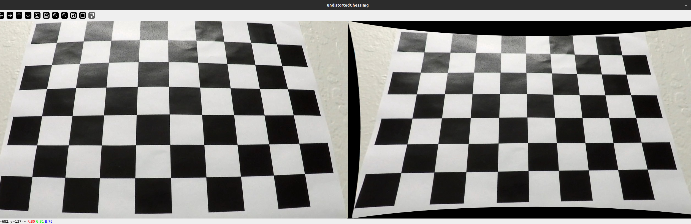
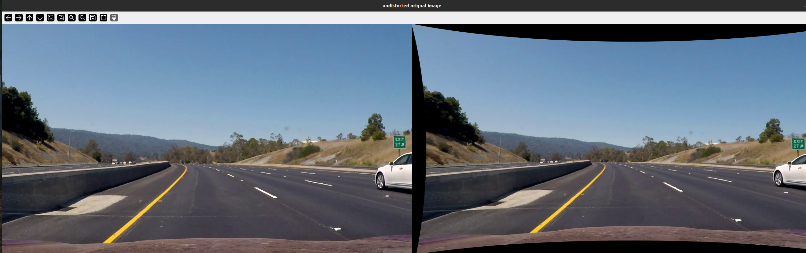
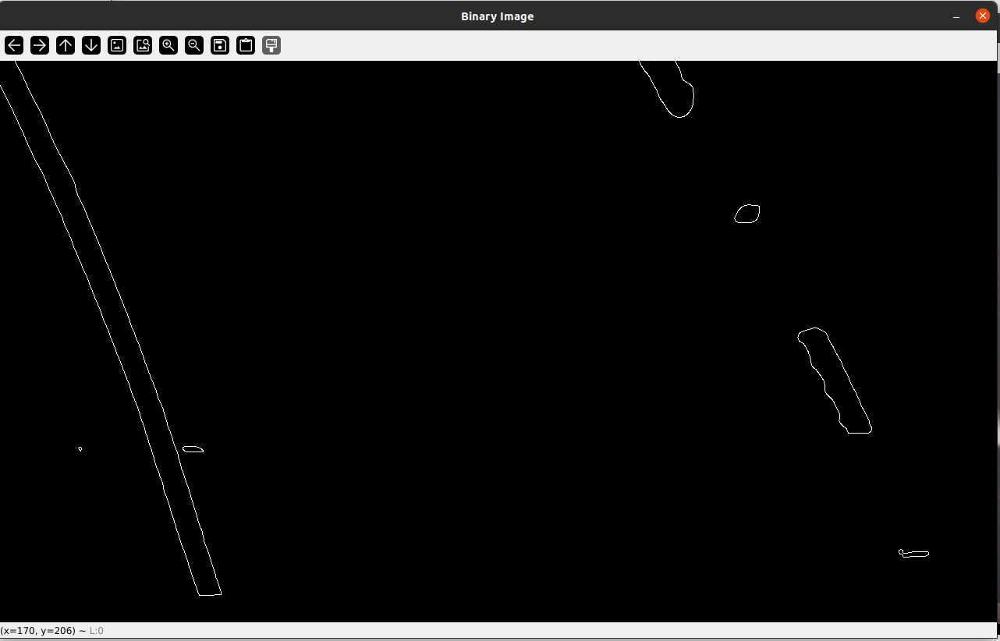
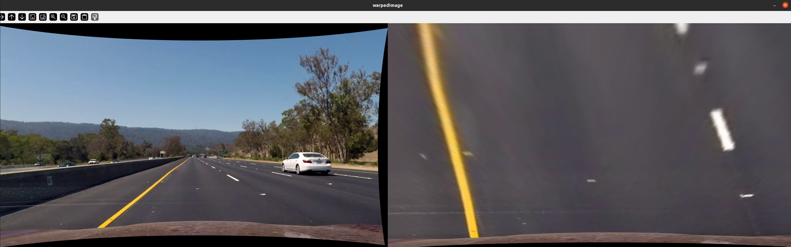
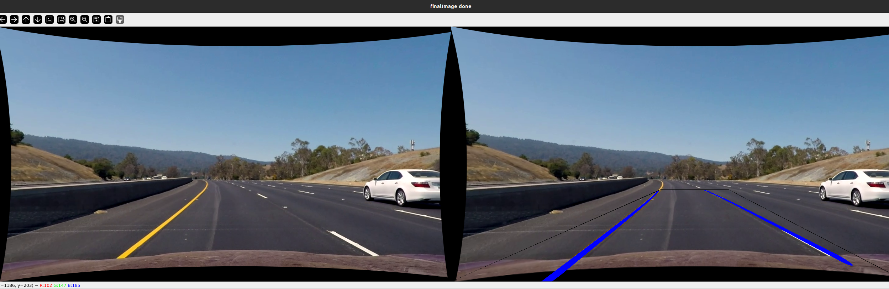

**Lane Finding Project**

The goals / steps of this project are the following:

* Compute the camera calibration matrix and distortion coefficients given a set of chessboard images.
* Apply a distortion correction to raw images.
* Use color transforms, gradients, etc., to create a thresholded binary image.
* Apply a perspective transform to rectify binary image ("birds-eye view").
* Detect lane pixels and fit to find the lane boundary.
* Determine the curvature of the lane and vehicle position with respect to center.
* Warp the detected lane boundaries back onto the original image.
* Output visual display of the lane boundaries and numerical estimation of lane curvature and vehicle position.

[//]: # (Image References)

[image1]: ./examples/undistort_output.png "Undistorted"
[image2]: ./test_images/test1.jpg "Road Transformed"
[image3]: ./examples/binary_combo_example.jpg "Binary Example"
[image4]: ./examples/warped_straight_lines.jpg "Warp Example"
[image5]: ./examples/color_fit_lines.jpg "Fit Visual"
[image6]: ./examples/example_output.jpg "Output"
[video1]: ./project_video.mp4 "Video"

---

### Writeup / README

#### 1. Provide a Writeup that includes all the rubric points and how you addressed each one.

Done

### Camera Calibration

#### 1. Briefly state how you computed the camera matrix and distortion coefficients. Provide an example of a distortion corrected calibration image.

Za izračunavanje matrice kamere i koeficijenata distorzije, korišćene su slike šahovske table snimljene iz različitih uglova. Korišćene su funkcije cv2.findChessboardCorners za pronalaženje unutrašnjih uglova šahovske table i cv2.calibrateCamera za izračunavanje matrice kamere (mtx) i koeficijenata distorzije (dist). Dobijeni rezultati sačuvani su u fajl (calib.npz) za dalju upotrebu.

Kasnije je fajl učitan i korišćen za korekciju distorzije pomoću cv2.undistort funkcije, a nova matrica kamere je izračunata pomoću cv2.getOptimalNewCameraMatrix.

### Pipeline (single images)

#### 1. Provide an example of a distortion-corrected image.

#### 2. Describe how (and identify where in your code) you used color transforms, gradients or other methods to create a thresholded binary image.  Provide an example of a binary image result.

Slika je konvertovana u crno-belu koristeći cv2.cvtColor, a zatim je primenjen cv2.GaussianBlur da bi se smanjio šum. Nakon toga korišćena je cv2.threshold funkcija za pravljenje binarne slike, gde su vrednosti iznad određenog praga postavljene na belo. Na kraju je primenjena cv2.Canny za detekciju ivica, kako bi se bolje izdvojili oštri prelazi, što je korišćeno za prepoznavanje traka na putu.

#### 3. Describe how (and identify where in your code) you performed a perspective transform and provide an example of a transformed image.

Prvo su definisane početne tačke (srcPoints) koje predstavljaju ključne tačke na slici iz originalnog videa. Zatim su definisane tačke odredišta (dstPoints), koje predstavljaju kako bi te tačke izgledale iz ptičje perspektive.

Korišćene su funkcije cv2.getPerspectiveTransform za kreiranje matrice transformacije i cv2.warpPerspective za primenu te transformacije na neiskrivljenu sliku, čime je dobijena transformisana slika (warpedImage). Ovaj proces omogućava da se put prikaže kao pravougaonik, olakšavajući detekciju traka.

#### 4. Describe how (and identify where in your code) you identified lane-line pixels and fit their positions with a polynomial?

U kodu je korišćena funkcija cv2.HoughLinesP, čiji je ulazni parametar izlaz  iz Canny detektora ivica. Linije koje su detektovane Hough transformacijom podeljene su na levu i desnu traku u zavisnosti od njihove pozicije u odnosu na sredinu slike. Nakon toga, koristi se funkcija drawCurve, koja kao ulazni parametar prima niz tačaka koje predstavljaju detektovane linije. Ova funkcija koristi np.polyfit da bi našla kvadratnu funkciju koja najbolje opisuje liniju. Na kraju, pomoću cv2.polylines je iscrtana linija na slici, prikazujući trake puta.

Pošto je slika koja sadrži iscrtane linije zapravo slika iz ptičje perspektive, odrađena je transformacija nazad u originalnu perspektivu

#### 5. Describe how (and identify where in your code) you calculated the radius of curvature of the lane and the position of the vehicle with respect to center.

Not done

#### 6. Provide an example image of your result plotted back down onto the road such that the lane area is identified clearly.

### Pipeline (video)

#### 1. Provide a link to your final video output.  Your pipeline should perform reasonably well on the entire project video (wobbly lines are ok but no catastrophic failures that would cause the car to drive off the road!).

https://drive.google.com/file/d/1E_t68nRpwW03J9-tlKVzHnQLQjPzuyVd/view?usp=drive_link

### Discussion

#### 1. Briefly discuss any problems / issues you faced in your implementation of this project.  Where will your pipeline likely fail?  What could you do to make it more robust?

U implementaciji projekta, suočeni su sa problemima u detekciji linija pri većim krivinama i lošijim kvalitetima slika, kao što su loša osvetljenost ili zamućenje. Takođe, fiksni parametri korišćeni u Canny i Hough transformacijama nisu uvek davali optimalne rezultate. Da bi se rezultati poboljšali, verovatno je potrebno koristiti neke druge tehnike izdvajanja ivica i određivanje leve i desne linije, što u trenutnoj izvedbi, nije najbolje rešeno.

